# Guia per a la Creació de Diagrames Entitat/Relació (E/R) en format Mermaid

Un diagrama Entitat/Relació (E/R) és una eina fonamental en el disseny de bases de dades. Permet modelar de manera visual l'estructura de les dades i les relacions que existeixen entre elles abans d'implementar-les en un sistema gestor de bases de dades (SGBD).

Aquesta guia cobreix tots els elements clau del model E/R, explicant-ne la representació i l'ús amb exemples pràctics.

## Entitats

Una entitat representa un objecte del món real, ja sigui físic o conceptual, sobre el qual volem emmagatzemar informació. Pensa en elles com els "substantius" de la nostra base de dades.

>Representació en Mermaid: es defineix amb el nomb de l'entitat en majúscules

>Exemple: Si volem dissenyar una base de dades per a una biblioteca, una entitat fonamental seria LLIBRE.

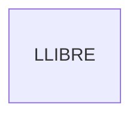

## Atributs

Els atributs són les propietats o característiques que descriuen una entitat. Són els "adjectius" que detallen cada instància d'una entitat.

> Representació en Mermaid: es defineixen dins de les claus {} de la seva entitat.

### Tipus d'Atributs

#### Atribut Identificador (Clau Primària)

És l'atribut que identifica de forma única cada instància de l'entitat. No hi pot haver dues instàncies amb el mateix valor en el seu atribut identificador.

> Representació en Mermaid: s'afegeix la restricció PK (Primary Key) a l'atribut.

> Exemple: Un LLIBRE s'identifica unívocament pel seu ISBN.

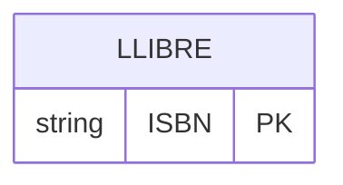

### Atributs Simples

Són atributs que no es poden dividir en parts més petites amb significat propi.

> Exemple: Titol i Any_publicacio són atributs simples del LLIBRE.

> Repressentació en Mermaid: s'afegeix el nom de l'atribut precedit pel tipus de dada

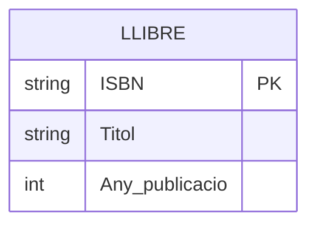

### Atributs no nuls

Son atributs que, per definició i disseny, mai poden estar sense valor

> Exemple: El titol del llibre

> Representació: Afegirem al final `"NOT NULL"`
> 
> Realment podem afegir al final el comentari que volguem, pero adoptarem la convenció de fer servir tots `"NOT NULL"`

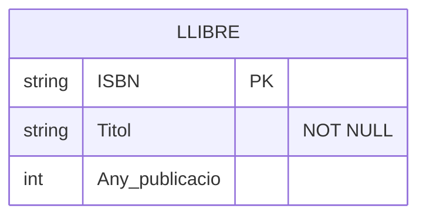

### Atributs Compostos

Són atributs que es poden descompondre en sub-atributs més petits i amb significat propi.

> Representació: Mermaid no té una sintaxi específica per a atributs compostos. La pràctica habitual és representar directament els seus components com a atributs simples.

> Exemple: Si tinguéssim una entitat AUTOR, el seu atribut Nom_complet es dividiria en Nom i Cognoms.
  
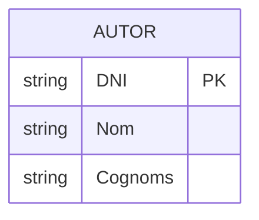

    

### Atributs Multivaluats

Són atributs que poden tenir múltiples valors per a una mateixa instància de l'entitat.

> Representació: Mermaid no suporta directament els atributs multivaluats. La solució correcta, que s'alinea amb la implementació final a la base de dades, és crear una nova entitat per a l'atribut i establir una relació d'un a molts.

> Exemple: Un LLIBRE podria pertànyer a diversos gèneres (ex: "Fantasia", "Aventura"). Creem una entitat GENERE i la relacionem amb LLIBRE.
  
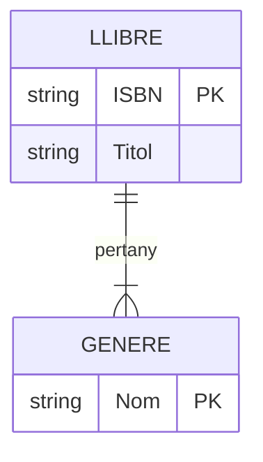

## Relacions

Una relació és una associació o vincle entre dues o més entitats. Representa les "accions" o "connexions" que existeixen entre els nostres "substantius".

> Representació: Es dibuixen com una línia que connecta les entitats, amb un verb descriptiu a l'etiqueta de la línia.

> Exemple: Un AUTOR escriu un LLIBRE.
  
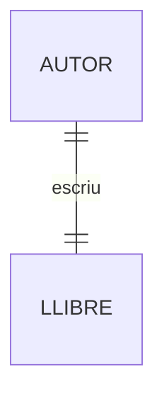

    

### Cardinalitat de la Relació

La cardinalitat indica el nombre d'instàncies d'una entitat que es poden relacionar amb una instància d'una altra entitat. Mermaid utilitza símbols a cada extrem de la línia per representar-la.

    |o : Un o zero

    || : Exactament un

    }o : Molts o zero

    }| : Molts o un

    o| : Zero o un

#### Un a Un (1:1)

Una instància de l'Entitat A es relaciona amb, com a màxim, una instància de l'Entitat B, i viceversa.

> Exemple: Un PROFESSOR dirigeix un DEPARTAMENT. Un departament només pot ser dirigit per un professor.
  
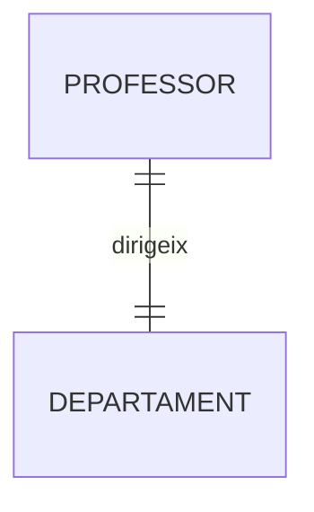
    
#### Un a Molts (1:N)

Una instància de l'Entitat A es pot relacionar amb diverses instàncies de l'Entitat B, però una instància de B només es relaciona amb una d'A.

> Exemple: Un AUTOR pot escriure molts LLIBRES, però un llibre (en aquest model simplificat) és escrit per un únic autor.
  

    

#### Molts a Molts (M:N)

Una instància de l'Entitat A es pot relacionar amb diverses instàncies de l'Entitat B, i viceversa.

>Exemple: Un LLIBRE pot ser pres en préstec per molts USUARIS, i un USUARI pot prendre en préstec molts LLIBRES.
 
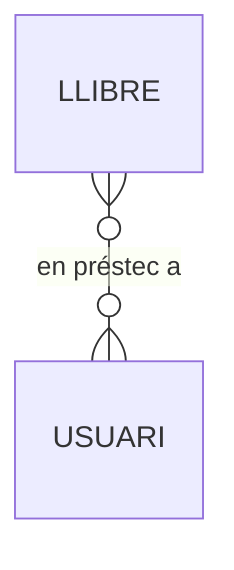

#### Altres exemples similars

##### Un ESCRIPTOR pot escriure entre zero i molts LLIBRES. Un LLIBRE ha de ser escrit per un i només un ESCRIPTOR
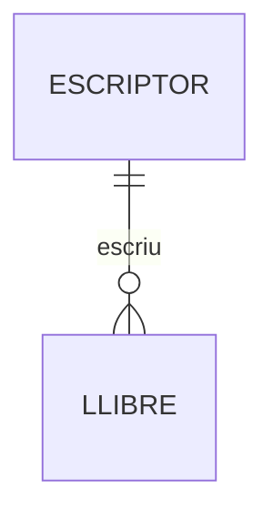

##### Un ESCRIPTOR pot escriure entre un i molts LLIBRES. Un LLIBRE ha de ser escrit per un i només un ESCRIPTOR

##### Un ESCRIPTOR pot escriure entre zero i molts LLIBRES. Un LLIBRE ha de ser escrit per un o molts ESCRIPTORS.
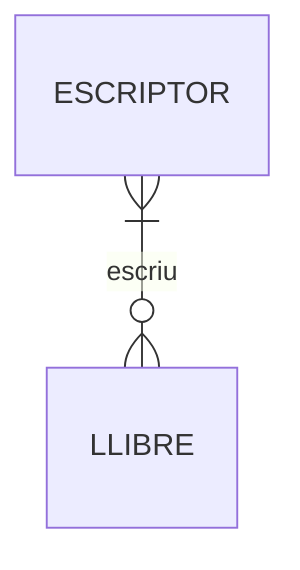

>[!IMPORTANT]
>Nota Important: Les relacions M:N no es poden implementar directament en una base de dades relacional.
>En passar al model relacional, es converteixen en una nova taula (anomenada taula intermèdia o d'unió).

Atributs a les Relacions

De vegades, un atribut no descriu una entitat, sinó la relació entre elles. Això és molt comú en relacions M:N.

> Representació: La manera correcta de modelar-ho, també per a la futura implementació, és convertir la relació en una entitat associativa. Aquesta nova entitat conté l'atribut i es connecta a les dues entitats originals.

> Exemple: En la relació de préstec, l'atribut Data_prestec no és del llibre ni de l'usuari, sinó de l'acte de prendre'l en préstec.
  
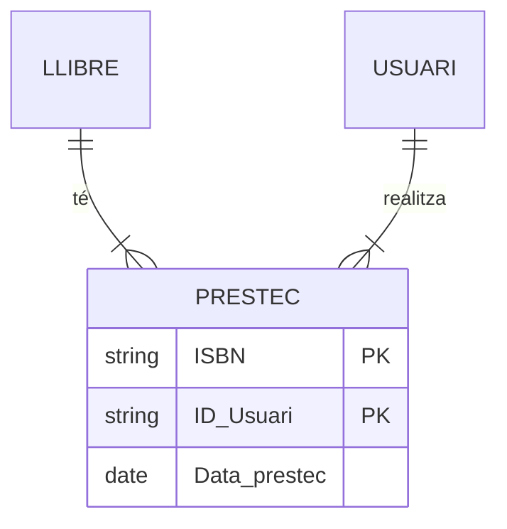

### Participació (Total vs. Parcial)

La participació indica si l'existència d'una instància d'una entitat depèn de la seva participació en una relació.

> Participació Total: Tota instància de l'entitat ha de participar en la relació (representat clàssicament amb una doble línia).

> Participació Parcial: No és obligatori que totes les instàncies hi participin (línia simple).

> Mermaid no té una notació específica per a la participació total. S'indica conceptualment a través de la cardinalitat. Una cardinalitat de "un o molts" (}|) o "exactament un" (||) implica participació total.

> Exemple: Una FACTURA no pot existir si no està associada a un CLIENT. Per tant, la participació de FACTURA en la relació és total. No obstant això, un CLIENT pot existir sense haver fet cap factura (participació parcial).
    
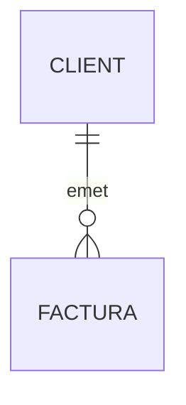
    
4. Entitats Febles

Una entitat feble és aquella l'existència de la qual depèn d'una altra entitat (anomenada entitat forta o propietària). No pot ser identificada unívocament només pels seus propis atributs; necessita la clau de l'entitat forta.

> Representació: Mermaid no té una sintaxi específica per a entitats febles (doble rectangle). Es representen com una entitat normal, però la seva clau primària depèn de la relació identificadora amb l'entitat forta. La clau primària de l'entitat feble es forma amb la clau de l'entitat forta més un discriminant propi.

> Exemple: Considerem una entitat EDIFICI i les seves HABITACIONS. Una habitació no pot existir sense un edifici i s'identifica pel seu número dins d'aquell edifici. HABITACIO és una entitat feble.
    
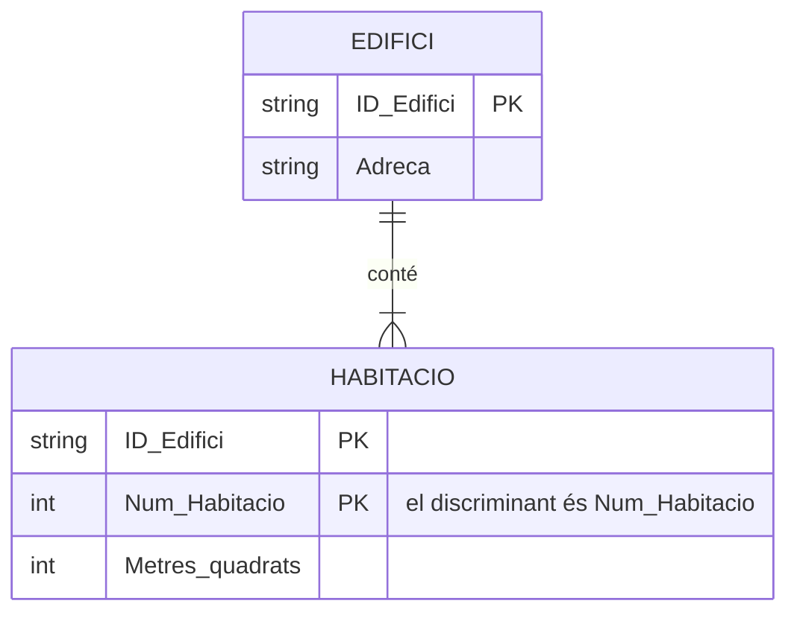

    

5. Relacions Reflexives (o Recursives)

Ocorren quan una entitat es relaciona amb si mateixa.

> Exemple: En una entitat EMPLEAT, alguns empleats supervisen altres. La relació SUPERVISA connecta EMPLEAT amb EMPLEAT. És útil afegir rols per aclarir el paper que juga l'entitat a cada extrem.
    
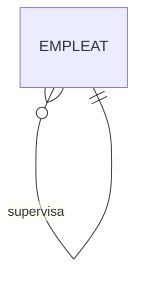

    

6. Generalització / Especialització (Herència)

Aquest concepte s'utilitza per a modelar jerarquies de "és un/a" (ISA, de l'anglès "is a"), similar a l'herència en programació orientada a objectes. Una entitat genèrica (superclasse) es pot especialitzar en sub-entitats més específiques (subclasses).

> Representació: el motor de Mermaid per a erDiagram no té una sintaxi específica i directa per representar la generalització/especialització (herència)

> Solució: Per representar aquest concepte correctament en un erDiagram, la millor pràctica és modelar la relació "és un/a" mitjançant una relació d'identificació u a u (||--||).
>
>Això significa que cada ALUMNE ha de ser exactament una PERSONA, i cada PROFESSOR ha de ser exactament una PERSONA. La clau primària de les entitats "filles" (ALUMNE, PROFESSOR) serà alhora una clau forana que fa referència a l'entitat "pare" (PERSONA).
    
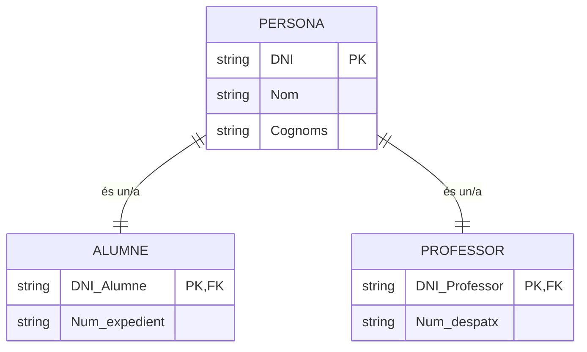

    
